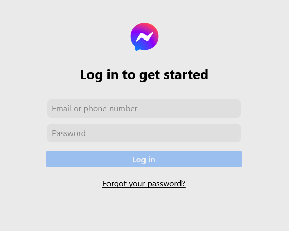

<h1><span style="color:salmon" >FACEBOOK MESSENGER </span> with SOCKET IO</h1>

## This is a clone of facebook messenger for learning purpose



[Table of contents]()

- [Install](#install)
- [Usage](#usage)

#### Install

```shell
npm install
```

#### Install Client

```shell
cd messenger

npm install
```
